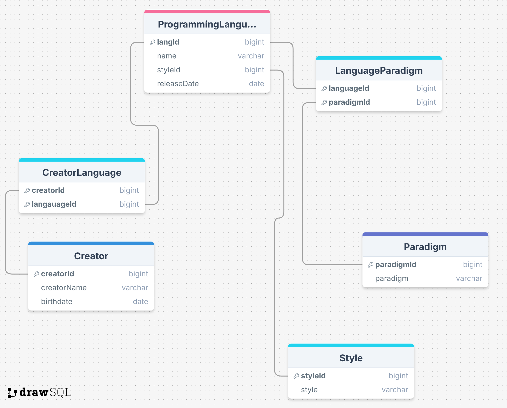

# Programming Language Schema

My project shows data about programming languages that some might to be interesting. It includes things like birth dates and years of designer/creators, the release date of languages, and the style and paradigm of each language.





## Query I thought it did well on

**Question**: Which language is the most similar to another language?

**GPT SQL Response**:
```sql
SELECT l1.name AS Language1, l2.name AS Language2, COUNT(*) AS SharedParadigms
FROM LanguageParadigm lp1
JOIN LanguageParadigm lp2 ON lp1.paradigmId = lp2.paradigmId AND lp1.languageId < lp2.languageId
JOIN Language l1 ON lp1.languageId = l1.languageId
JOIN Language l2 ON lp2.languageId = l2.languageId
GROUP BY l1.languageId, l2.languageId
ORDER BY SharedParadigms DESC
LIMIT 1;
```

**Friendly Response**: The most similar languages are C++ and Python with a similarity score of 3.

I personally think that this is weird but if you are going off of paradigms then this would make sense.


## Question that it tripped up on
This one is interesting because while it did succeed, it relied on the data being in a certain order.
Had the order been different, this query would have failed.

Question: Which programming language has the median release date?

**GPT SQL Response**:
```sql
WITH ordered AS (
    SELECT 
            languageId,
            name,
            releaseDate,
            ROW_NUMBER() OVER (ORDER BY releaseDate) AS rn,
            COUNT(*) OVER () AS cnt
        FROM Language
    )
    SELECT name
    FROM ordered
    WHERE rn = (cnt + 1) / 2;
```

SQL Result is [('Lisp')] which was correct at the time of running because I accidentally didn't put in the right date for it. It should have been C++.

**Friendly response**: The programming language with the median release date is Lisp.

## Multi-shot vs Zero-shot

I tried both and it seems that Zero-shot gave the best responses. Often times with Multi-shot, it would 
give me responses where it just gave the id of the language, which is very unhelpful from a user point of view. 
This also defeats the point of having an AI help since you would then have to craft a query to then select for that 
particular column. I also tried including the context of each of the queries so that it would have a greater 
understanding of the data but that really tripped up the Multi-shot and caused it to provide responses to previous
questions sometimes.


## Conclusion
I used the o1-mini model for this and found that it is really good at single prompting but not so with Multi-shot
with context. Maybe I should have not tried to add the context to see what would happen, but the results were interesting. I hope that AI can improve in the future and be better at generating SQL to make interacting with databases easier for all.


